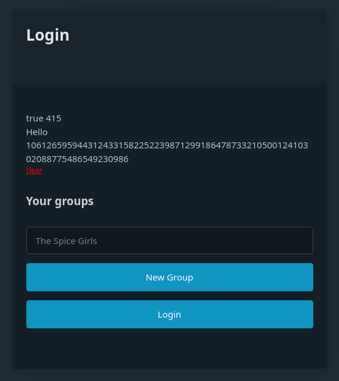

⚠️ STATUS: NOT READY FOR PRODUCTION USE ⚠️

It's a proof-of-concept/demo for ethBerlin04. The main structure is in place, but I need to connect some parts to make it functional. I plan to do this in the first half of June, and will announce it here when it's ready:  https://tally.so/r/wvr558

# ZKal - freedom-respecting group calendar server

ZKal addresses our reliance on centralised calendar systems, particularly Google Calendar, even among those who advocate for decentralisation. Breaking free is challenging due to its ingrained network effects and the varying technical abilities within groups.

zKal tips the balance.  It's a self-hosted calendar server proxy that uses semaphores, a type of zero-knowledge proof that proves group membership without revealing any other user data.

## Key Problems Addressed

1. **Meeting Confusion**: Users often face problems like confusion over meeting links, with some using Jitsi while others use Google Meet links that were automatically added.
   
2. **Scalability Issues**: Google Calendar struggles with large groups, especially with over 400 or 500 invites.
   
3. **Data Sharing**: Sharing data with Google allows them to create detailed shadow profiles, including information about who you spend time with.
   
4. **Political Centralisation**: SaaS tools' political/administrational centralisation assumptions creates silos between teammates, by defaulting teams to opacity between each other, causing coordination issues and missed opportunities.

## ZKal Solution
ZKal is designed to create gravity towards community-sovereignty and non-custodiality, making it easier for tech communiies to degoogle and regain control over their calendar data.

It provides a self-hosted (proxied) calendar feed with a web-based widget that integrates multiple .ICS feeds, allowing for a gradual transition away from Google Calendar.

## Screenshots

### Access with Semaphore

### Calendar View

### RSVP or Anon Add To Cal

### Features

- **Semaphore Integration**: Users access ZKal through [Semaphore](https://semaphore.pse.dev/), maintaining anonymity while proving group membership.

- **Distributed Calendar Administration**: Supports multiple ICS feeds, allowing different rooms or groups to operate on various systems without an all-or-nothing switch from Google Calendar.

- **Proxied Calendar Access**: Users access all event data through a self-hosted proxy, preventing back-ends from seeing subscribers, attendees, IPs, etc. 
  
- **RSVP and Event Creation**: Users can add to their calendar anonymously, or RSVP publicly within the Semaphore group.
  
### Trust Model

zKal's starting point is to allow for:
- Users interact with a self-hosted zKal server, hosted by their own community. RSVP and subscriber information is stored there, and under their stewarship.
- User access is granted by proving group membership using a semaphor.
- No event information is sent to back-end calendar providers.  
- Users can optionally RSVP, disclosing their email address to the zKal server and others witn
- Users can interact anonymously, even with their zKal server, which sees only their IP and their group membership proof.

Future versions will include zuPass to make semaphore management more convienient to admins, and I'm looking for ZK patterns to even keep RSVP info off the zKal server.

### Stack
  - Ethereum Foundation's Semaphore libraries
  - Svelte for its simplicity and small components.
  - Node adapter for easy deployment on Docker containers, rooted wifi fridges or any device that's better than a Google datacenter.

  
